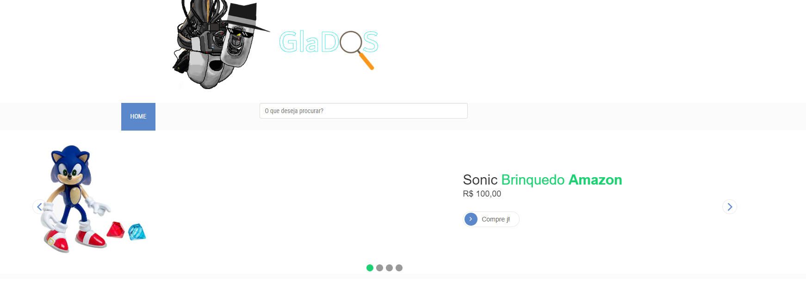
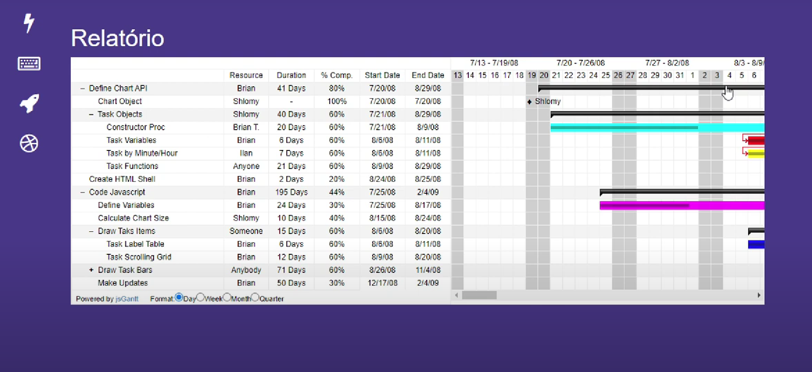
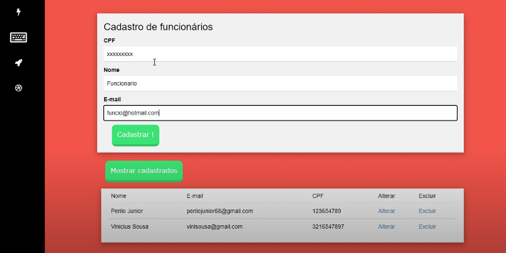
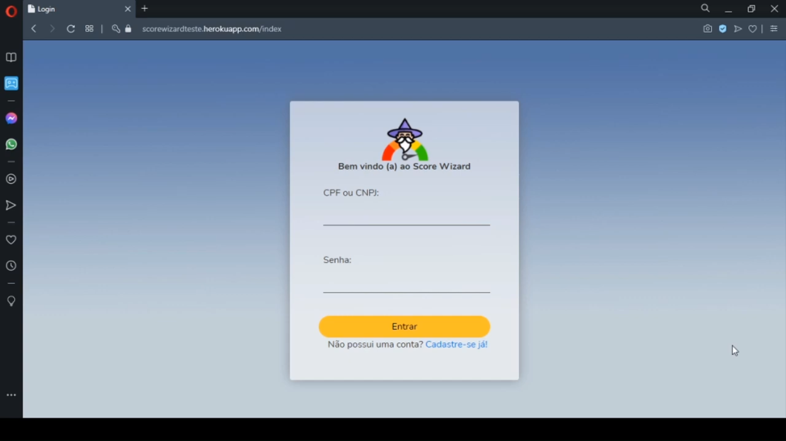
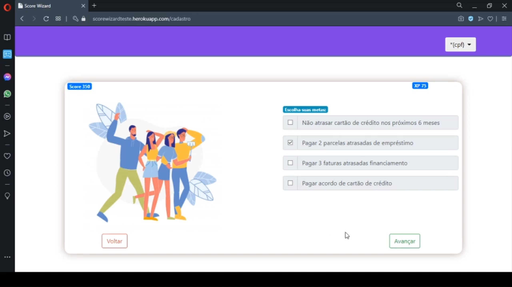
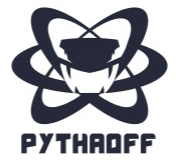
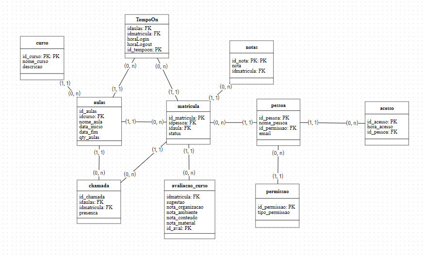
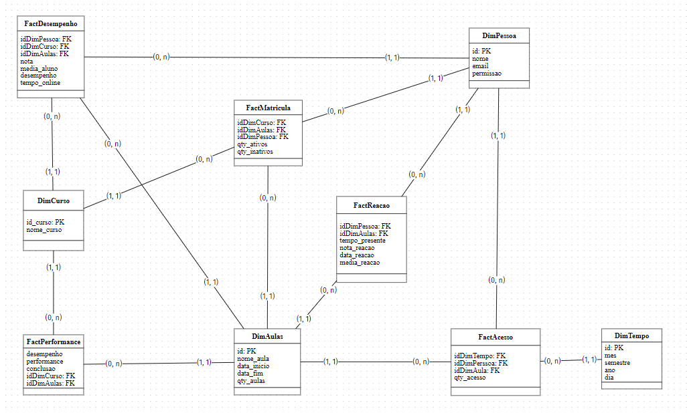
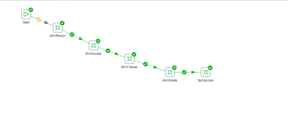
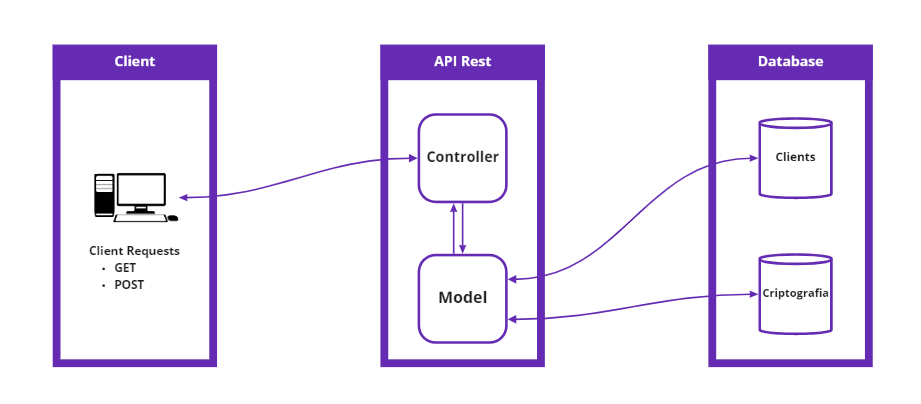

## **Sobre mim**

Meu nome é Perilo, formado em técnico em Informática pelo Colégio Técnico Opção e graduando em tecnólogo em Banco de Dados pela FATEC-SJC.
<br>
Atuo como desenvolvedor desde 2019 quando iniciei minha carreira na EMBRAER, atuando com automação de processos executados manualmente por projetistas, além de cuidar da infraestrutura local. Atualmente trabalho como desenvolvedor e suporte ao cliente na empres ProcessWare. Minha jornada na área permitiu ampliar minha visão em todas as áreas possíveis de atuação e atualmente tenho foco e estudo diariamente artigos relacionados a Banco de Dados pois foi a área de atuação a qual melhor me identifiquei. 

### **Contato**
* [Gitlab](https://gitlab.com/perilojunior68)
* [LinkedIn](https://www.linkedin.com/in/perilo-carvalho-de-oliveira-junior-2b668216a/)
* E-mail: perilojunior68@gmail.com
 
### **Principais Conhecimentos**
* Python 
* C#
* Java 
* Oracle, MySQL, PostreSQL
* Data Warehouse

---

## Meus Projetos

  
  

## Em 2019-2

  

<div  align="center">


<div  height="50"></div>

</div>

  
  

Com a proposta do Projeto Integrador de fornecer uma solução para que os alunos buscassem um problema, foi desenvolvido o projeto [GlaDOS](https://gitlab.com/omnitron/glados).

  

A solução apresentada foi a construção de um WEB Bot que deveria atender uma demanda específica de um usuário final.<br>

  

Pensando na proposta, foi analisada e levantada a ideia de construção de um procurador de ofertas na Amazon, que tinha como objetivo buscar os melhores preços dentro da plataforma e calcular sua porcentagem de desconto quando houvesse.

  

Para suprir necessidades de radar de preços para pessoas físicas, GlaDOS tinha os seguintes objetivos:

  

- Busca de preços em sites de compra;

  

- Análise de desconto;

  

- Comparativo de preços.

  

### Tecnologias Utilizadas
- Python
  - Utilizada para construção das principais funções do sistema com o auxílio de suas bibliotecas para raspagem de dados.

- Vue.js
  - Utilizada para construção dos layouts das páginas, utilizando o conceito de Single Page Application (SPA).

- HTML, CSS e JavaScript
  - Principais recursos utilizados também para construção da interface do projeto.

- MySQL
  - Para armazenamento de informações do sistema, utilizado para ser o banco de dados do projeto.

### Contribuições Individuais

No desenvolvimento da GlaDOS, fui designado para atuar de forma mais ativa no desenvolvimento do Back-end, desta forma, desenvolvi o código principal do projeto para a Raspagem de Dados utilizando as bibliotecas lxml e request.<br>

  

Também fui atribuído com para as atividades de desenvolvimento da interface onde os produtos seriam dispostos no sistema. Para isso foi utilizado os recursos HTML, CSS e JavaScript com o auxílio dos frameworks Vue.js e Bootstrap.<br>

  

Abaixo uma imagem do resultado final do sistema, onde, ao inserir o produto era apresentada a imagem e informações pertinentes referente ao mesmo.

  

<div  align="center">



<div  height="300"></div>

</div>

<br>

  

Também como contribuição, tive o objetivo de realizar nivelamento de equipe, desenvolvi dois materiais para uma base de conhecimento no projeto, estes que explicavam como realizar a raspagem de dados com as bibliotecas mencionadas e uma segunda base que ensinava os comandos básicos de SQL.

  

### Hard Skills Efetivamente Desenvolvidas
- Python
  - Neste período foi desenvolvido de maneira efetiva as noções de linguagem e aprendizados de lógica de programação, além de conhecimentos com operação utilizando bancos de dados. Também foi efetivado o conhecimento da utilização das bibliotecas lxml e request para a raspagem de dado.

- HTML, CSS, JavaScript
  - Neste projeto foi possível desenvolver breves noções da utilização das três linguagens em conjunto, sendo aplicado para desenvolvimento de páginas simples.

- Metodologia Scrum
  - O primeiro contato utilizando metodologias ágeis, neste período foi desenvolvidas as principais noções referente ao assunto o que seria melhor desenvolvidos nos demais semestres.

- Utilização de ferramentas de controle de versão de arquivos(Git)
  - Situação semelhante ao desenvolvido na metodologia Scrum, onde a ferramenta foi utilizada conforme o exemplificado mas que seria melhor utilizada nos demais semestres.

  

### Soft Skills Efetivamente Desenvolvidas

- Comunicação
  - O primeiro projeto desenvolvido em grupo na instituição, foi preciso desenvolver a parte social para uma melhor comunicação com o time.

- Interpretação
  - Uma das maiores dificuldades no início, interpretar corretamente o que deveria ser feito, neste semestre tivemos o auxílio dos alunos do último semestre do curso para esta tarefa.

- Priorização
  - Neste período foi apresentado o estudo de prioridades no projeto, onde foi feita uma atividades para identificar quais seriam as entregas que deveriam ser realizadas primeiro.

  

## Em 2020-1

  

<div  align="center">


<div  height="50"></div>

</div>

  

Diferentemente da proposta do semestre anterior onde tínhamos a solução e precisávamos achar um problema, neste projeto tivemos como parceiro acadêmico a empresa Necto, que possuía o desafio de criar um gerenciador de projetos com o planejamento sendo demonstrando através de um diagrama de Gantt.<br>

  

Com o desafio, desenvolvemos o sistema [Pineapple](https://gitlab.com/perilojunior68/visao-estrategica-de-projeto) pensando em ser um sistema flexível, intuitivo e de fácil utilização conforme os requisitos da empresa Necto.<br>

  

A aplicação possuía as seguintes funções:

  

* Gerenciamento de Funcionários;

* Gerenciamento de Projetos;

* Gerenciamento de Tarefas;

* Relatório de atividades.

  

### Tecnologias Utilizadas 
- Java
  - Utilizada para construção das principais funções do sistema com o auxílio de suas bibliotecas para criação de um projeto WEB, no caso, utilizando a ferramenta Jave Server Pages.

- Java Server Pages (JSP)
  - Framework utilizada para criação do projeto WEB com a linguagem de programação Java, o Framework foi escolhido por ser semelhante ao PHP.

- HTML, CSS e JavaScript
  - Principais recursos utilizados também para construção da interface do projeto.

- Bootstrap
  - Foi utilizada para auxílio da criação de interfaces, especificamente na criação de formulários de cadastros.

- MySQL
  - Para armazenamento de informações do sistema, utilizado para ser o banco de dados do projeto.

- Gradle
  - Framework para importação de dependências, utilizado principalmente para facilitar a importação de dependências em outros computadores dos integrantes do grupo.

### Contribuições individuais

Neste projeto fui responsável pela criação das principais funções do sistema, desde o cadastro de entidades até as funções do gráfico de Gantt.

  

Também fui responsável por desenvolver a interface do projeto incluindo também a estilização do gráfico, conforme as imagens abaixo.<br>

  

Diagrama de Gantt, interface principal do projeto.

  

<div  align="center">



<div  height="300"></div>

</div>

<br>

  

Interface de cadastro de funcionários, os demais cadastros seguem o mesmo padrão com cores diferentes

  

<div  align="center">



<div  height="300"></div>

</div>

  

Este semestre tive o papel de Scrum Master da equipe participando de reuniões semanais, apoiando e trabalhando junto com a equipe, com atribuições de tarefas e exercendo papel de facilitador para conhecimento técnico no projeto, onde toda a tarefa atribuída nas Sprints eram previamente estudadas para que fosse possível sanar todas as dúvidas que surgissem na equipe.

  

### Hard Skills Efetivamente Desenvolvidas

- Java
  - Foi possível aprender toda a sintaxe da linguagem e também os conceitos de orientação a objeto, este tópico que seria desenvolvido no próximo semestre.

- Java Server Pages (JSP)
  - A utilização da ferramenta teve seu aprendizado facilitado por ser semelhante ao PHP, neste período foi possível efetivar o conhecimento básico com sentimento de que era possível desenvolver muitos outros tópicos com a ferramenta.

- MySQL
  - Para armazenamento de informações do sistema, utilizado para ser o banco de dados do projeto.

- Gradle
  - Neste período utilizamos o Gradle como uma ferramenta para facilitar a compilação do projeto nos computadores, mas conforme foi estudado foi possível entender o propósito da ferramenta, sendo utilizada em projetos futuros na instituição.

- Requisições HTTP
  - Neste período foi o primeiro contato com as requisições HTTP, sendo desenvolvido de maneira bem intuitiva com materiais disponibilizados na internet.

- Programação Orientada a Objetos
  - Conforme mencionado no tópico de Java, foi desenvolvida noções básicas desta metodologia de programação o que seria mais desenvolvido de maneira prática nos semestres futuros

- 10 Heurísticas de Nielsen
  - Neste período foi estudado as 10 Heurísticas de Nielsen que viabilizam uma interface de usuário ideal para o projeto. No sistema desenvolvido foi aplicado pelo menos 4 Heurísticas sendo elas: Usabilidade, Flexibilidade, Design minimalista e Reconhecimento.

### Soft Skills Efetivamente Desenvolvidas

- Organização
  - Este foi o primeiro projeto a ser desenvolvido de maneira remota, por esse fator houve todo uma nova adequação para a nova modalidade de ensino, desta forma foi necessária a disciplina para organizar todas as pendências do projeto;

- Administração de projetos
  - Com o papel de master, foi necessário o aprendizado para organização de Sprints e comunicação com os integrantes da equipe;

- Comunicação interpessoal
  - Como master senti a necessidade de manter todos da equipe motivados com o projeto, desta forma foi necessário estudar o temperamento de cada integrante para interagir da melhor forma possível.

## Em 2020-2

  

<div  align="center">


<div  height="50"></div>

</div>

  

Em parceria com o SPC Brasil, foi proposto o desenvolvimento de uma ferramenta que serviria de complemento para o sistema Cadastro Positivo.

  

Com o desafio proposto, realizamos o desenvolvimento da ferramenta [Score Wizard](https://gitlab.com/perilojunior68/score-wizard-3-semestre) que atende a necessidade de pessoas físicas e jurídicas em ter uma gestão melhor de sua pontuação Score. De maneira prática, a ferramenta auxilia o usuário a traçar seu objetivo mostrando metas que irão ajudar o usuário a alcançar o objetivo determinado. Como feature foi desenvolvido um sistema de gamificação onde determinadas ações do usuário acrescentaria pontos de experiência em seu perfil, estes pontos que poderiam ser usados como "moeda" para troca de serviços no SPC.<br>

  

De maneira resumida o projeto possui as seguintes funções:

  

- Cadastro de pessoas físicas e jurídicas;

- Calcular o Score dos usuários;

- Criação de metas para serem concluídas;

- Criação da interface para loja de funções.

  

### Tecnologias Utilizadas

- Java
  - Utilizada para construção das principais funções do sistema com o auxílio de suas bibliotecas para criação de um projeto WEB, no caso, utilizando a ferramenta SpringBoot.

- SpringBoot
  - Spring foi utilizada para o desenvolvimento das principais funções do sistema, utilizando de requisições HTTP para criação de métodos.

- Maven
  - Utilizado como ferramenta de automação de compilação, utilizada devido a facilidade de integração observada com o Gradle semestre passado.

- HTML, CSS e JavaScript
  - Principais recursos utilizados também para construção da interface do projeto.

- Bootstrap
  - Foi utilizada para auxílio da criação de interfaces, especificamente na criação de formulários de cadastros. 

- Thymeleaf
  - Framework para utilização de templates foi utilizado para facilitar a criação das interfaces do sistema desenvolvido.

- Hibernate
  - Utilizado como uma ferramenta para facilitar o mapeamento objeto/relacional dentro do sistema, a ferramenta foi utilizada após uma reunião com a equipe.

- MySQL
  - Para armazenamento de informações do sistema, utilizado para ser o banco de dados do projeto.

### Contribuições individuais

Diferentemente dos outros semestres, durante a concepção do Score Wizard, atuei como recurso de apoio para todas as áreas do projeto. Exercendo um trabalho como ferramenta facilitadora para todos os pontos de risco durante o desenvolvimento do projeto, atuando como Back-end desenvolvendo e auxiliando partes do código fonte bem como atuação no Front-end esboçando o modelo de layout do projeto.

  

Como novidade, fui responsável também pela parte de Deploy do projeto utilizando a ferramenta Heroku.

  

Primeira tela do sistema onde é possível a realização do login

  

<div  align="center">



<div  height="300"></div>

</div>

<br>

  

Objetivos propostos aos usuários do sistema

  

<div  align="center">



<div  height="300"></div>

</div>

  

### Hard Skills Efetivamente Desenvolvidas
- Envio de aplicação para nuvem (Deploy)
  - Através da ferramenta Heroku, aprendi a realizar de maneira efetiva;

- Maven
  - Utilizado como substituto do Gradle, onde foi possível identificar que são ferramentas diferentes que prestam para o mesmo propósito.

- Thymeleaf
  - Neste período, para ganho de tempo para o desenvolvimento foi desenvolvido o uso de templates para agilizar o desenvolvimento das interfaces e manter o foco nas atividades mais importantes para o cliente.

  

### SoftSkills Efetivamente Desenvolvidas

  

- Criatividade
  - Como não houve a definição exata da solução para o cliente, foi necessário pensar em uma ideia que pudesse ser útil para o produto.

- Comunicação
  - Após mudar de equipe, foi necessário conhecer e saber se comunicar com os integrantes que faziam parte da nova equipe.

- Foco
  - Para as atividades que exerci, foi necessário que mantivesse o maior foco possível em um ambiente remoto para que as Sprints fossem cumpridas, desta forma houve uma mudança em meu comportamento pessoal.

  

## Em 2021-1

  

<div  align="center">


<div  height="50"></div>

</div>

  

Em parceria com a empresa Jetsoft, foi proposta a ideia de um gerenciador de currículos que possuía a principal função de encontrar a vaga mais indicada para determinado perfil, para suprir esta necessidada foi criado o sistema [Pythaon]([Pythaoff](https://gitlab.com/gurst6/projeto-integrador-pythaon)).

  

O objetivo foi buscar uma solução para auxiliar na busca de canditados para vagas de emprego na empresa, o projeto deveria como objetivo principal ter a função de evasão de funcionários, para reduzir custos tais como transporte e aumentar a satisfação para alocações mais adequadas com o perfil do candidato.

  

Desta maneira o projeto possui as seguintes funções:

  

- Gerenciamento de vagas;

- Gerenciamento de candidatos;

- Busca por candidatos com perfil da vaga;

- Busca por critérios com o perfil da vaga;

  

O sistema gerenciava os currículos de forma que eram atribuídos para as vagas com os requisitos mais próximos aos descritos no currículo. Utilizando principalmente de ferramentas existentes no MongoDB para atingir o objetivo.

  
  

### Tecnologias Utilizada

  

- Python
  - Utilizada para construção das principais funções do sistema com o auxílio de suas bibliotecas para criação de uma API para busca de currículos

- Django
  - Foi utilizado por conta do seu modelo MVC que facilitaria na criação do projeto.

- MongoDB
  - Banco de dados não relacional, utilizado pela suas ferramentas de geolocalização que auxiliariam em uma das principais funções do projeto.

- Postman
  - Para os testes da API por envio de requisições HTTP, foi utilizado pela versatilidade que a ferramenta oferece.

  

### Contribuições individuais

Neste projeto o maior foco foi a criação de uma API Back-end apenas, neste contexto fui responsável pela criação das funções de cadastro de currículos e pessoas, e a criação da função de busca por vaga com o requisito "VT0" onde procurava por pessoas a uma determinada distância da vaga em questão.

  

Neste projeto também fiquei responsável pela pesquisa de um Design Pattern que poderia ser utilizado na aplicação, onde ficou definido a implementação do Observer para verificar a ocorrência de uma vaga nova para um perfil.

  

Para comparação também desenvolvi a função de requisito VT0 pelo Back-end em Python, esta implementação serviu para comparar o desempenho ganho em realizar a busca diretamente pelo Banco de Dados.

  

### Hard Skills Efetivamente Desenvolvidas

- MongoDB
  - Neste período foi aprendido o funcionamento de um banco de dados não relacional e sua estrutura JSON, também foi desenvolvida suas funções dentro da própria base de dados que colaboraria com desempenho do projeto.

- Integração Python com MongoDB
  - Por se tratar de uma banco de dados não relacional, foi necessário o estudo da integração com este tipo de banco, no caso foi utilizada a biblioteca Djongo que auxiliou na integração da ferramenta.

- Implementação do Design Pattern Observer
  - Como parte da proposta do API, foi levantado com a equipe e estudado a utilização de Design Patterns no sistema, o Observer foi selecionado e seu conceito foi aplicado com êxito pelo time.

### Soft Skills Efetivamente Desenvolvidas
- Comunicação
  - Neste semestre foi bem desenvolvida a questão de comunicação com o cliente, sendo muito necessário para entender o conceito e objetivo do mesmo com a aplicação.

- Interpretação

  - Neste período foi desenvolvida de maneira efetiva o levantamento de requisitos com o cliente, este tópico foi desenvolvido de maneira pessoal com o primeiro.

## Em 2021-2

  

<div  align="center">



<div  height="50"></div>

</div>

  

Neste período, o projeto proposto teve como empresa parceira a Ness, propondo o desafio de desenvolver uma solução de dados voltada para o ensino a distância, neste contexto foi criada aplicação [Pythaoff](https://gitlab.com/gurst6/pythaoff-ness/-/tree/main/).

O sistema deveria promover uma gestão para instituições de ensino, aproveitando o projeto desenvolvido por outra equipe de API nos semestres anteriores.

Para atingir os objetivos de gestão, o sistema deveria contar com os seguintes relatórios:

- Engajamento: quais alunos/colaboradores estão fazendo o curso no qual está matriculado;

- Desempenho: qual o aproveitamento - nota atingida - no curso no qual está matriculado;

- Participação x taxas de conclusão x desempenho dos alunos/colaboradores;

- Avaliação de reação: qualificação do conteúdo apresentado, experiência do aluno/colaborador durante o curso;

- Registro do tempo de participação no curso: tempo online executando as atividades;

  

Também foi solicitado que a aplicação armazenasse logs de utilização dos chats durante a aula, todas as ações realizadas pelos usuários deveriam ser armazenadas para estudo.

O projeto também deveria contar com a utilização da tecnologia de DataWarehouse para criação de todos os relatórios solicitados.

  

### Tecnologias Utilizada

  

- SQL
  - Banco de Dados usado para armazenar as informações de aluno, professor, curso, matéria e etc.

- Python 
  - O Back-end do projeto foi criado com a linguagem de programação Python:

- Django
  - Foi framework de projeto usado para a criação da aplicação.

- Selenium
  - Foi o framework usado para a criação do script de automação para o Webbot coletar os dados na Web;

- Gradle
  - Utilizamos Gradle para gerenciar os importes, dependências e bibliotecas que foram utilizadas no projeto, especificamente no back-end;

- Power BI
  - Foi a ferramenta de OLAP para exibir os dados persistidos no banco de dados .

- BrModelo
  - Para modelagem do Banco de Dados Relacional e o Data Warehouse

- Pentaho
  - Ferramenta utilizada para realizar o processo de ETL no banco de dados

  

### Contribuições individuais

Na construção do sistema fiquei responsável pela modelagem e criação do Banco de Dados relacional (M.E.R), Data Warehouse e os devidos processos de ETL para preenchimento dos relatórios solicitados.

  

**M.E.R (Modelo Entidade Relacionamento)**

<br>

<div  align="center">



<div  height="300"></div>

</div>

Com a proposta de armazenar o desempenho das aulas na plataforma, a estrutura definida para o armazenamento de dados foi pensada para abranger informações dos alunos, professores e aulas dos respectivos cursos. Com estas informações foi possível extrair os relatórios solicitados no projeto.

**Data Warehouse**

<br>

<div  align="center">



<div  height="300"></div>

</div>

Como um dos requisitos técnicos, a utilização de um Data Warehouse, este modelo que fica armazenado em um outro banco de dados, possuindo a proposta de armazenar apenas as informações importantes para os relatórios solicitados. <br>
O esquema utilizado para criação do Banco de Dados foi o Star Schema, onde as tabelas chamadas dimensão "Dim" relacionam-se diretamente com a tabela de fatos "Fact". A utilização deste esquema foi devido a praticidade e desempenho superior ao comparar com o SnowFlake Schema.

**Processo de ETL desenvolvido**

<br>

<div  align="center">



<div  height="300"></div>

</div>

Para alimentar a base de dados do Data Warehouse utilizamos o processo chamado "Extract, Transform, Load
(ETL)", este processo que se baseia em três fases.
 - Extract: Nesta fase, esses dados são extraídos da base de dados de origem e transferidos para um ambiente Data Warehouse, local onde podem ser trabalhados pelo sistema ETL de maneira independente. No projeto, cada bloco acima com prefixo "dim" se trata do projeto de extração de sua respectiva tabela original.
 - Transform: Nesta fase, esses dados são extraídos e transferidos para um ambiente Data Warehouse, local onde podem ser trabalhados pelo sistema ETL de maneira independente. No projeto, o bloco "factAccess" realiza o processo de tratamento de dados para o relatório de engajamento no sistema.
 - Load: A última fase de ETL consiste na carga dos dados transformados, ou seja, na entrega dos dados consolidados ao sistema de destino.
Também realizei o processo para os demais relatórios solicitados no projeto.

### Hard Skills Efetivamente Desenvolvidas

- Modelagem de Banco de Dados relacional
  - Com a atividade de modelagem do M.E.R foi possível aprender e compreender de forma prática a melhor maneira de realizar a tarefa, entrando em contato com o cliente para saber de sua necessidade, observar dados necessários e não necessários afim de desenvolver uma modelagem concisa e organizada.

- Modelagem Data Warehouse
  - Atividade atribuída para mim onde seria a principal atividade do API deste semestre, com esta atividade foi possível compreender através de pesquisas a importância da utilização de dados em forma de Data Warehouse para relatórios de grandes empresas. O principal aprendizado foi com o esquema de Estrela utilizado em todos os relatórios desenvolvidos no projeto.

- Processo ETL
  -  Também como complemento do aprendizado anterior, o processo de transformação dos dados da base de origem para os dados que utilizaremos nos relatórios foi uma atividade onde houve o aprendizado da utilização de ferramentas para realizar ETL, onde no primeiro momento foi desenvolvido através do próprio código em Python, porém no meio do projeto alterei o processo para a ferramenta Pentaho, uma ferramenta própria para este processo, com a ferramenta foi possível observar o ganho da produtividade neste processo, utilizando de blocos para realizar de maneira automática muitos processos que seriam mais complexos de serem realizados no código Python.

- Criação de Dashboards pelo PowerBI
  - Parte de nossa integração foi realizada na plataforma PowerBI, desta forma foi necessário aprender as principais funções do sistema e como poderia ser realizada a integração com a base de dados Data Warehouse, bem como definições de layout para uma melhor disposição dos dados.

### Soft Skills Efetivamente Desenvolvidas

- Colaboração
  - Para atender com as expectativas do projeto deste período, foi necessário realizar diversas reuniões internas com a equipe visando especificamento o nivelamento dos integrantes da equipe com a tecnologia de Data Warehouse. Com esta situação, foi possível observar a importância de colaborar com o time para atingir um objetivo.

- Atitude
  - O desenvolvimento de toda arquitetura do banco de dados relacional e Data Warehouse foram feitas de maneira individual, foi necessário tomar a iniciativa para realizar pesquisas e networking para um entendimento referente ao assunto, desta forma foi desenvolvido uma característica pessoal para sempre tomar iniciativas e levantar os riscos em atividades individuais.

- Autogestão
  - Durante a primeira Sprint houve um desvio de comunicação e tempo que ocasionou em uma entrega com qualidade abaixo do esperado no tópico de Data Warehouse, com isso, para as próximas Sprints levantei um esquema de gerenciamento pessoal visando gerenciar as atividades com o tempo disponível até a próxima Sprint, desta forma para as próximas entregas não houve sobrecargas e foi possível atender as demais entregas com qualidade.

- Adaptação
  - Devido a uma decisão tomada no início do projeto, solicitei para que meu foco no desenvolvimento fosse voltado para a criação do Banco de Dados relacional e Data Warehouse, desta forma sai da área do Back-end onde existia conforto por estar mais acostumado e parti para uma nova área que ainda não havia desenvolvido para um projeto na escala deste API. Esta mudança foi necessária para verificar minha capacidade de adaptação com um ambiente novo, assim me familiarizando com casos que ocorrem rotineiramente em ambiente de profissional.

## Em 2022-1

<div  align="center">



<div  height="300"></div>

</div>


Como proposta final de final do curso de Banco de Dados, assim como no primeiro projeto, não tivemos um parceiro acadêmico mas desta vez foi proposto um projeto final em disciplinas matriculadas no 6º período. Neste contexto será utilizado o projeto que aborda as Leis Gerais de Proteção de Dados (LGPD), especificamente os temas: Opt-in Opt-out, Exclusão e Anonimização. O projeto pode ser analisado através do link: [Telefonia](https://gitlab.com/bielqcsjc/labvi-telefonia
O projeto proposto foi o sistema com aplicação da LGPD em uma empresa de Telefonia, onde são armazenados diversos dados pessoais e sensíveis a aplicação da lei, desta forma o sistema contará com as seguintes funções:
- Escolher quais permissões seriam concedidas ao sistema, armazenando um histórico de versão e concessão de permissão.
- A exclusão de informações sensíveis ou dados pessoais dos usuários.
- A criação de um sistema de recomendação de pontos de interesse utilizando geolocalização.

### Tecnologias utilizadas
- Python
  - Principal linguagem de programação do sistema, utilizada para criação de todo o Back-end do projeto.
 - PeeWee
   - Object-Relational Mapping (ORM) utilizado no projeto, utilizado por se tratar de uma ORM minimalista que serviria de maneira efetiva em implementações de pequeno/médio porte como o caso do projeto desenvolvido. 
- Banco de dados SQLite
   - Como a implementação não seria complexa no lado do banco de dados, utilizamos o banco SQLite por sua simplicidade e fácil integração para demonstração dos resultados do projeto.

### Contribuições individuais
**Anonimização**
<br>
Neste projeto fiquei com a responsabilidade do processo de anonimização do indivíduo previsto na LGPD pelo Art. 5º. III. Desta forma, no projeto foi implementado um sistema de indicação de locais, onde caso a permissão de uso de dados de geolocalização do usuário fosse concedida, o usuário receberia em seu celular os principais locais mais próximos de sua localização.
Deste modo foi realizado uma implementação onde seria passada as informações de ID, latitude, longitude e distância máxima em metros de recomendação. Com estes parâmetros seria realizada uma busca do local mais próximo cadastrado na base de dados e como resultado seria devolvido uma estrutura JSON informando o nome do local, o tipo de estabelecimento e a distância em metros do usuário conforme o exemplo abaixo:
```json
{
	"user": 1,
	"lat": "-23.23547236880072",
	"long": "-45.87986381107677",
	"maxDistance": "1000"
}
```
Arquivo JSON passado via requisição onde é informado o ID, informações de localização e a distância máxima de recomendação.
No processo, será validado se o usuário concedeu a autorização para uso de seus dados de localização através da integração com o Opt-in Opt-out. Caso tenha permitido o uso será retornado um JSON com as informações do local de recomendação mais próximo, conforme abaixo:
```json
{"Local": "Barbearia Man", 
"Tipo": "Barbearia", 
"Distancia": "133"}
```
Caso não tenha concedido o uso de sua geolocalização, apenas será retornada a mensagem: "Not Authorized".

### Hard Skills Efetivamente Desenvolvidas
 - Mapeamento objeto-relacional
   - Neste projeto foi possível estudar e ter aprendizado de uma ORM minimalista (PeeWee) com boa implementação para projetos até médio porte, também foi adquirida uma maior familiaridade com integrações utilizando este tipo de tecnologia.
- Aplicação da LGPD
  - Como a proposta principal, foi desenvolvido diversos conhecimentos sobre aplicação desta lei, entendendo a importância de sua utilização e como os casos mais conhecidos de falhas em sua aplicação poderiam ser contornados através de uma melhor integração.
- Anonimização
  - Principal tópico da LGPD que apliquei neste semestre foi possível compreender as diversas formas que este tópico poderia ser aplicado, desde a utilização em relatórios até utilização em sistemas de recomendação de locais e compras.
- Exclusão de dados de usuários
  - Também  como integração neste projeto foi desenvolvida a utilização da função de exclusão de informações dos usuários cadastrados, nesta implementação foi desenvolvido conhecimento de utilização de bibliotecas de criptografias e como são utilizadas na prática para exclusão de dados sem precisar deletar efetivamente o registro em tabelas.
- Opt-in Opt-out
  - Como terceiro tópico abordado neste semestre, foi desenvolvida a prática de sempre solicitar a autorização de usuários quando se trata de utilização de seus dados para as funções do sistema e também a importância de se armazenar um histórico com as autorizações concedidas ao sistema juntamente com sua versão e data para caso ocorra alguma denuncia de más práticas de LGPD com o sistema.
### Soft Skills Efetivamente Desenvolvidas
- Iniciativa
  - Visando incentivar os demais membros da equipe, foi necessário dar o primeiro passo para que todos colaborassem com a integração do projeto.
 - Tomada de decisão
   - Com as dúvidas esclarecidas durante o desenvolvimento do projeto, foi necessário compilar todas as informações coletadas e colocar no papel para o desenvolvimento em equipe, definindo os principais objetivos principalmente na integração do Opt-in Opt-out pois este afetaria o desenvolvimento do tópico de anonimização.
- Gestão de tempo
	- Durante o desenvolvimento do projeto levantei a necessidade de realizar uma priorização para o desenvolvimento do mesmo, neste tópico foi realizado um gerenciamento do tempo para conseguir realizar a entrega das demandas propostas no início do projeto.